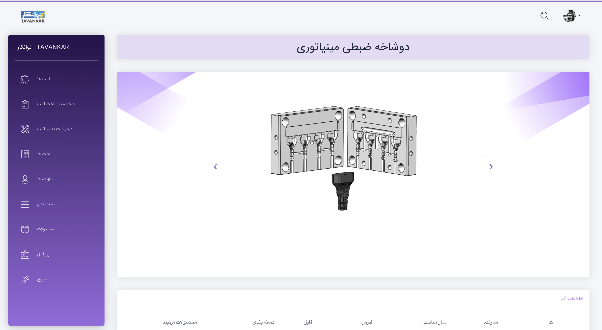
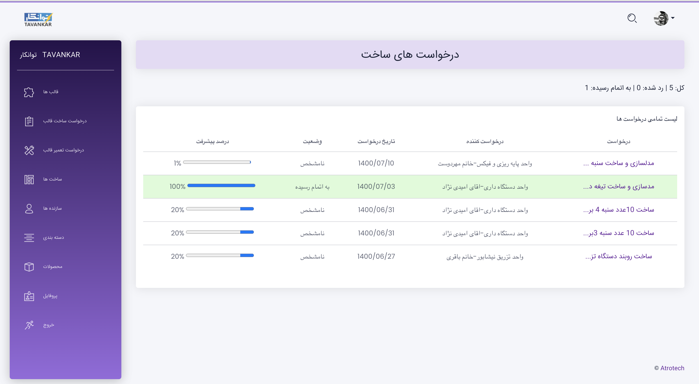

# Mold Management System ( MMS )

Open-source project generated by [Atrotech](https://atrotech.ir/) in **Django** Framework. 


### Screenshots

<table>
  <tr>
  <td align="center">
      <a href="https://github.com/nimadorostkar/MMS/blob/master/screenshots/1.png">
        
      </a>
      <br />
      <p>Mold detail Page</p>
    </td>
    <td align="center">
      <a href="https://github.com/nimadorostkar/MMS/blob/master/screenshots/2.png">
        
      </a>
      <br />
      <p>Mold repair requestPage</p>
    </td>
    </tr>
</table>

### Clone this repository

```
git clone https://github.com/nimadorostkar/MMS.git
```

### Run the following commands to get started:

```
pip install -r requirements.txt
python manage.py makemigrations
python manage.py migrate --run-syncdb
python manage.py runserver
```
